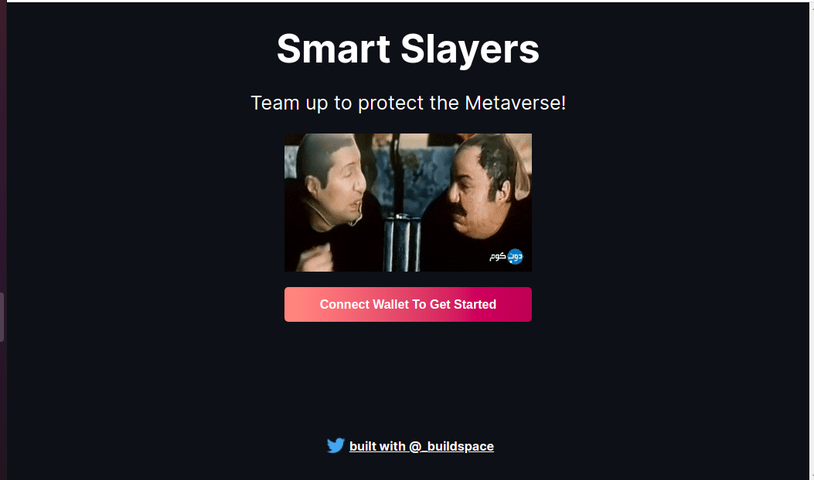
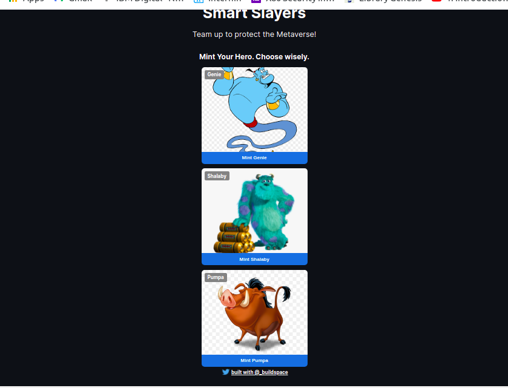
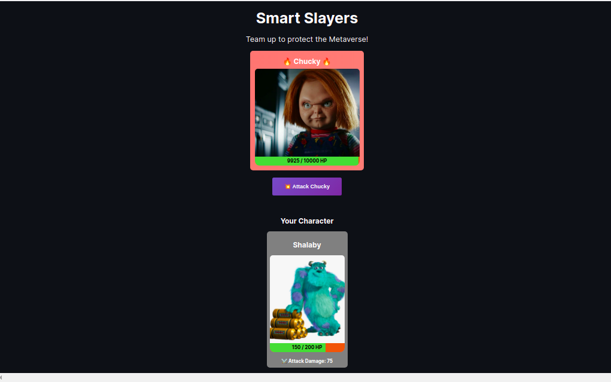

# Simple turn-based NFT browser game (Buildspace Second Project)
<!-- 

 -->
  Connect Metamask             |    Mint NFT           |      ATTACK!
:-------------------------:|:-------------------------:|:-------------------------:
  |   |  

## Brief:

- I built this project following Buildspace course.(https://buildspace.so/)
- I used hardhat, ethers.js, IPFS (just on the client side), and deployed on Rinkeby testnet. (0xF5950c5fE17f9eE2359F65a11C7aDF95d164Ac90)
- The goal of our game will be to destroy a boss.
- The boss (Chucky) has 10,000 HP(Hit/Health Points). What players do is when they start the game, they mint a character NFT (Genie/Shalaby/Pumpa) that has a certain amount of Attack Damage and HP. Players can order their character NFT to attack the boss and deal damage to it.
- The goal? Players need to work together to attack the boss and bring its HP down to 0. The catch? Every time a player hit the boss, the boss hits the player back! If the NFT's HP goes below 0, the player's NFT dies and they can't hit the boss anymore. Players can only have one character NFT in their wallet. Once the character's NFT dies, it's game over. That means many players need to join forces to attack the boss and kill it.
- The boss will not be an NFT. The boss’s data will just live on our smart contract.

- So, when a player goes to play the game:
  1) They'll connect their wallet.
  2) Our game will detect they don't have a character NFT in their wallet.
  3) We'll let them choose a character and mint their own character NFT to play the game. Each character NFT has its own attributes stored on the NFT directly like: HP, Attack Damage, the image of the character, etc. So, when the character's HP hits 0, it would say hp:0 on the NFT itself.

## Later To-Do:
- Show all the other players in the game!
- Add in critical hit chance: for example maybe there's a 5% chance that some of your characters hit for double the damage. Or maybe there's a 20% chance the boss's attack "misses" and the player gets away lucky!

## Check it on Repl.it:
Link: (https://nft-game-starter-project.mennaabuelnaga.repl.co/)